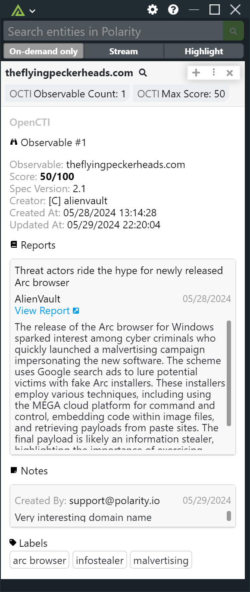
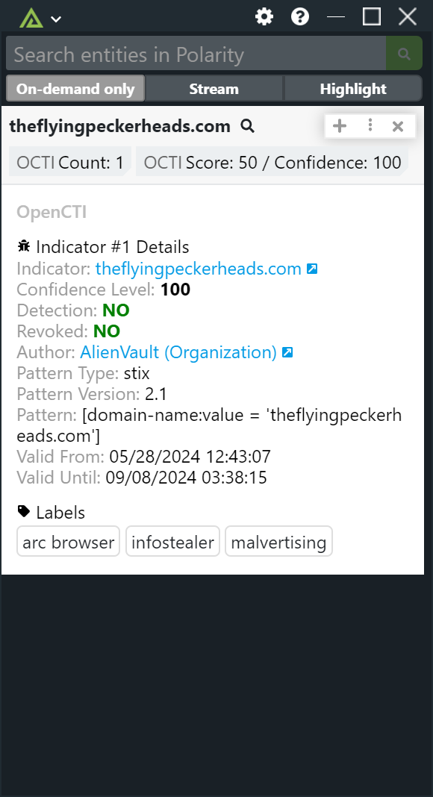

# Polarity OpenCTI Integration

Polarity's OpenCTI integration queries various indicator types against the OpenCTI GraphQL API.

|    |   |
|------------------------------|----------------------------|
| *Observable Result Example* | *Indicator Result Example* | 

Please see [OpenCTI](https://www.opencti.io/) for more information.

## OpenCTI Integration Options

### OpenCTI URL

The Base URL for your OpenCTI instance including the scheme. (i.e. - https://myopenctiserver). Option must be set to "Users can view only".

### OpenCTI API Key

Valid OpenCTI API Key found in your OpenCTI user account profile.

## Open Data Sources

The OpenCTI integration will query for Observables or Indicators. Select the data sources you would like to query for.

## Installation Instructions

Installation instructions for integrations are provided on the [PolarityIO GitHub Page](https://polarityio.github.io/).

## Polarity

Polarity is a memory-augmentation platform that improves and accelerates analyst decision making. For more information about the Polarity platform please see:

https://polarity.io/
