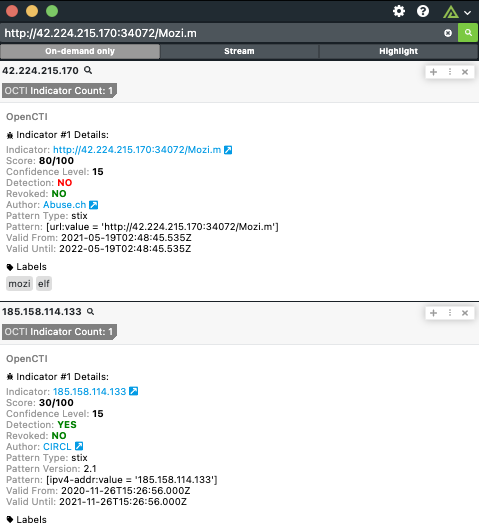

# Polarity OpenCTI Integration

Polarity's OpenCTI integration queries various indicator types against the OpenCTI GraphQL API.

Please see [OpenCTI](https://www.opencti.io/) for more information.

## OpenCTI Integration Options

### OpenCTI URL
The Base URL for your OpenCTI instance including the schema. (i.e. - https://myopenctiserver)

### OpenCTI API Key
Valid OpenCTI API Key found in your OpenCTI user account profile.

## Installation Instructions
Installation instructions for integrations are provided on the [PolarityIO GitHub Page](https://polarityio.github.io/).

## Polarity
Polarity is a memory-augmentation platform that improves and accelerates analyst decision making.  For more information about the Polarity platform please see:

https://polarity.io/
